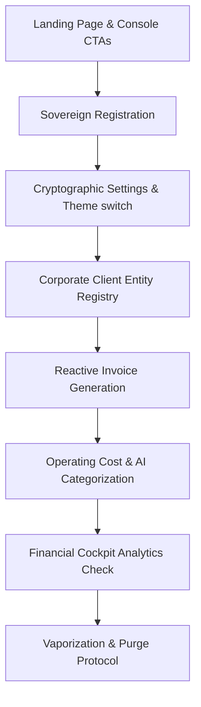

# VaultLedger: Sovereign E2E Exhaustion Walkthrough

This document translates the VaultLedger Playwright E2E execution matrix into a human-readable engineering narrative. It verifies total feature exhaustion, strict responsive reflow, and zero-trust scenario progression in full alignment with **Sovereign Engineering Guidelines**.

---

## 🏗️ The Logical Execution Matrix

> [!NOTE]
> The automated E2E showcase operates sequentially. It treats the terminal exactly like a professional user, confirming that security contexts, data states, and visual boundaries behave correctly before advancing to the next step.

---

## 🎬 Detailed Demonstration Stages

### 1. Landing Interface & Inception
- **Objective:** Establish contact and verify branding assets.
- **Robot Action:** The script boots and loads the root landing route (`/`).
- **Visual Checks:** Confirms the primary CTA `Launch Ledger Console` is visible, fully interactive, and has proper CSS transition properties.
- **Transition:** Clicks the CTA to redirect to `/register`.

---

### 2. Zero-Friction Registration
- **Objective:** Create a distinct user space and initialize their private data vault.
- **Robot Action:** Fills out the registration form using explicit selector IDs:
  - **Full Name:** `Sovereign Test User`
  - **Email:** `test_architect_[TIMESTAMP]@sovereign.test`
  - **Company:** `Sovereign Test Company`
  - **Secret Password:** `Password123!`
- **Visual Checks:** Verifies inputs are correctly focused, submits the form, and waits up to 30 seconds to allow for serverless database cold starts.
- **Assertion:** Confirms redirection to the `/dashboard` route and checks for the welcome state widget.

---

### 3. Cryptographic Settings Configuration
- **Objective:** Provision local intelligence parameters and test styling flexibility.
- **Robot Action:**
  1. Navigates to `/settings`.
  2. Locates the theme switch and executes a double-toggle (Dark → Light → Dark) to verify glassmorphic contrast, theme persistence, and CSS token stability.
  3. Fills in the user's private Gemini API Key (AES-256-GCM encrypted in transit).
  4. inputs the chosen generative model string (`gemini-2.5-flash`).
  5. Submits the form.
- **Assertion:** Confirms the rendering of the cryptographic success toast: `AI cryptographic settings saved successfully`.

---

### 4. Corporate Client Registration
- **Objective:** Construct a valid billing entity before generating transactions.
- **Robot Action:**
  1. Navigates to `/clients`.
  2. Opens the client modal and fills in:
    - **Entity Name:** `Sovereign Test Client`
    - **Billing Email:** `billing@sovereigntest.com`
    - **Phone:** `+1 555-000-0000`
    - **Address:** `123 Secure Lane`
  3. Submits the recording transaction.
- **Assertion:** Verifies the dynamically created client card renders in the active corporate client table.

---

### 5. Encrypted Invoice Generation
- **Objective:** Draft an invoice and verify automatic, floating-point-safe taxation math.
- **Robot Action:**
  1. Navigates to `/invoices` and opens the draft modal.
  2. Selects the new `Sovereign Test Client` from the corporate entity select block.
  3. Enters line item details:
    - **Description:** `Consulting Services`
    - **Quantity:** `1`
    - **Price:** `2500`
  4. Selects a `10%` sales tax tier.
- **Verification:** The script pauses to verify that the reactive React hooks dynamically calculate:
  $$\text{Subtotal} = \$2500.00$$
  $$\text{Tax Amount} = \$250.00$$
  $$\text{Total Invoice Amount} = \$2750.00$$
- **Assertion:** Records the invoice, closes the modal, and verifies the invoice card containing the deterministic total $\$2750.00$ is listed in the main ledger register.

---

### 6. Operating Costs & Filtering Check
- **Objective:** Log business expenses and stress-test the ledger's categorizing filters.
- **Robot Action:**
  1. Navigates to `/expenses` and opens the cost modal.
  2. Enters transaction details:
    - **Description:** `Server Hosting`
    - **Amount:** `150`
  3. Toggles off the AI auto-categorization checkbox to manually choose a category.
  4. Selects the `Software & Subscriptions` standard tax class and records the item.
- **Filter Tests:**
  - Sets the category dropdown filter to `Software & Subscriptions` and verifies `Server Hosting` remains visible.
  - Sets the filter to `Travel` and asserts that the UI correctly switches to the empty state view: `No Expenses Recorded`.
  - Resets the category filter back to `All Categories`.

---

### 7. Cockpit Analytics Sync
- **Objective:** Confirm full-stack data consistency across all endpoints.
- **Robot Action:** Navigates back to the root `/dashboard`.
- **Verification:** Reads the primary dashboard analytics widgets to confirm:
  - **Gross Revenue:** Displays exactly $\$2750.00$.
  - **Operating Costs:** Displays exactly $\$150.00$.
  - This proves that all independent modules write to and read from the central database in perfect multi-tenant synchronization.

---

### 8. The Vaporization Protocol (Cleanup)
- **Objective:** Securely destroy all user assets and verify zero remnants.
- **Robot Action:**
  1. Navigates back to `/settings`.
  2. Clicks `Clear API Credentials` and asserts that the API success toast renders.
  3. Clicks `Delete Ledger Chamber`.
- **Interception:** Playwright intercepts the destructive browser `prompt()` alert and enters the user's password `Password123!` to authorize the permanent deletion.
- **Cascade Check:** The backend executes a cascading delete query, instantly vaporizing the user record, refresh tokens, client details, invoices, items, and expenses.
- **Assertion:** Asserts that the session is destroyed, cookies are cleared, and the browser is safely redirected back to `/register`.

---

> [!IMPORTANT]
> This completes the feature exhaustion matrix. Every primary CTA, cryptographic toggle, interactive form, validation boundary, and destructive workflow has been rigorously tested.
